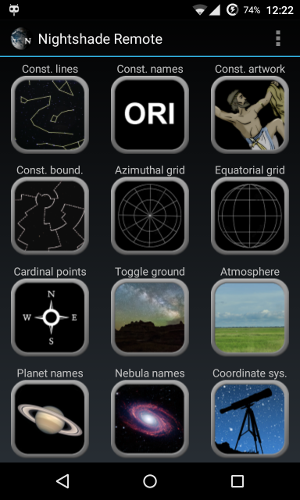
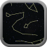
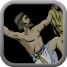
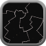
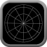
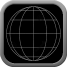
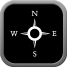
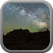
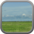
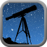

# Android remote control for Nightshade

## Overview
NightshadeRemote is an [Android](https://www.android.com/) based remote controller
for the popular [Nightshade](http://www.nightshadesoftware.org/projects/nightshade)
astronomy software.

NightshadeRemote allows teachers to wander freely within a planetarium's dome, and control the
Nightshade simultaneously.

## Features

### Controlling the appearance
The desktop Nightshade has 12 toggle controls on the bottom left that toggle the following features:
<table>
    <tr>
        <td>Icon</td><td>Function</td><td></td>
    </tr>
    <tr>
        <td>      </td>
        <td>Constellation lines</td>
        <td rowspan="12"></td>
    </tr>
    <tr><td>      </td><td>Constellation names</td></tr>
    <tr><td>        </td><td>Constellation artworks</td></tr>
    <tr><td>      </td><td>Constellation boundaries</td></tr>
    <tr><td>         </td><td>Azimuthal grid</td></tr>
    <tr><td>        </td><td>Equatorial grid</td></tr>
    <tr><td>  </td><td>Cardinal points</td></tr>
    <tr><td>          </td><td>Ground</td></tr>
    <tr><td>      </td><td>Atmosphere</td></tr>
    <tr><td>     </td><td>Planet names</td></tr>
    <tr><td>     </td><td>Nebula names</td></tr>
    <tr><td>   </td><td> Coordinate system</td></tr>
</table>

### Running scripts

The remote is capable of transmitting and running scripts found in its `NightshadeRemote/scripts`
folder on the external storage.

This screen also provides controls for manipulating the speed of time (faster, slower, real,
current).

*Currently listing the available scripts on the machine where the Nightshade runs is not available.
That would require modifications in the Nightshade codebase, but shouldn't be difficult.
As soon as the NS part works, implementing on the Android side should be quick.*

### Custom buttons (short scripts)
There are usually some short, but frequently used commands that are not mapped to the toggle
buttons (e.g. Fly to the Earth). On the custom buttons screen one can create and edit such short
commands, name them, can quickly execute them.

_**Warning:** Although most script commands work here to, some are known to fail, occasionally
crashing the Nightshade too!_

### Notes
It is often necessary to take notes during a presentation, or have some prepared data quickly
available. The Notes function provides a solution for this. If there are multiple notes, the
currently available can be chosen from a spinner.

### Object manager
_**Warning!** This is an entirely experimental feature, and doesn't always work as expected!_

The object manager provides a search interface to look up certain objects by their catalogue number.
If an object is found, and there is an image associated with it, the image is displayed.

This screen also provides an experimental zoom control.

## Installation

### Manual cloning
Clone this repository, and from [Android Studio](http://developer.android.com/sdk/index.html) select
*File -> New -> Import project*, browse the cloned folder, and follow the wizard.

### Importing from GitHub
In Android Studio select *File -> New -> Project from version control -> GitHub* and select the
repository. THe IDE should automatically clone and import the project.

